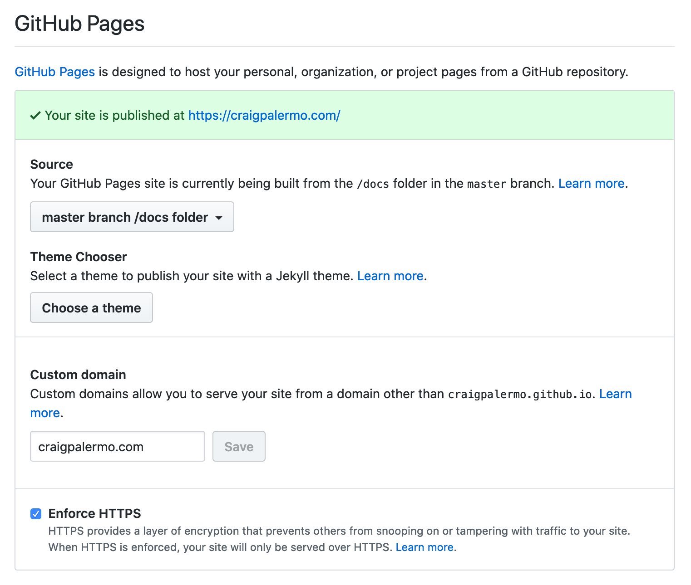

Yesterday, I was making some updates to this site and noticed that the process to publish updates was somewhat tedious.
In order to publish a change, I would need to manually run `npm run build`, commit and push the changes, then
return the the GitHub repo's settings to change the custom domain for GitHub pages back to `craigpalermo.com`. For
some reason, this kept resetting each time I pushed changes to the `docs` folder. I figured it had something to do
with the fact that I was serving the site from a custom directory, but I wasn't sure exactly why.

For reference, here's my GitHub Pages config to use a custom domain, building from a folder on `master`:

Today, I had the inclination to try replicating my manual build process with [GitHub Actions](https://github.com/features/actions),
GitHub's workflow automation feature. I hadn't used Actions before, so I thought this would be a good place to start.

I modified the default Node.js action to create [this simple workflow](https://github.com/craigpalermo/craigpalermo.com/blob/master/.github/workflows/main.yml).
It performs the following steps whenever `master` changes:

1) Checks out the repo
1) Installs NPM dependencies and Gatsby
1) Builds Gatsby static site
1) Commits changes (thanks to this [marketplace action](https://github.com/marketplace/actions/add-commit))

[This answer](https://github.com/gitname/react-gh-pages/issues/19#issuecomment-436148409) also explained why my
custom domain kept resetting and provided a simple fix that I could add to the `npm build` script.

Although I've only just started using GitHub Actions, I'm pleasantly surprised by how easy it makes setting up
a simple cloud CI environment with almost no configuration. Its email notifications sent to your GitHub
account email are also a nice way to receive updates about your build status.

Now I'll never have to worry about where this site is hosted or how it's deployed; all I have to do is push
changes to the Markdown or React content and GitHub takes care of the rest, all for free!